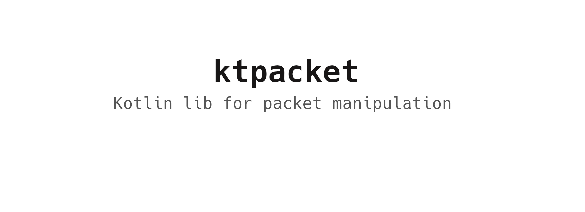

# ktpacket

Kotlin Packet manipulation tool.
The purpose of the application is to show how internet packages are built and how to connect them.

## Supported layers

ktpacket support:

* Ether
* IP
* TCP
* UDP
